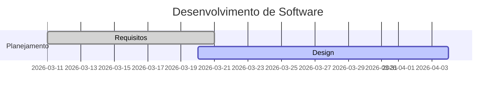

```mermaid
    gantt
    %%%Definir titulo principal
    title Desenvolvimento de Software

    %%%Definir o formato data (Ano-Mês-Dia)
    dateFormat YYYY-MM-DD

    %%%Criação do agrupamento visual para as tarefas iniciais
    section Planejamento
    %%%'done': Tarefa concluida(fica cinza). 'req' é o ID da
    %%%tarefa - 2026-03-11 'data de inicio' 10 d - 'duracao'
    Requisitos :done, req, 2026-03-11, 10d

    %%%'active' Tarefa em andamento
    Design :active, des, 2026-03-20, 15d

```
