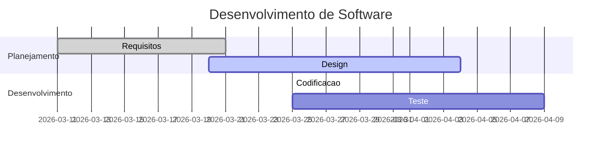

```mermaid
    gantt
    %%%Definir titulo principal
    title Desenvolvimento de Software

    %%%Definir o formato data (Ano-Mês-Dia)
    dateFormat YYYY-MM-DD

    %%%Criação do agrupamento visual para as tarefas iniciais
    section Planejamento
    %%%'done': Tarefa concluida(fica cinza). 'req' é o ID da
    %%%tarefa - 2026-03-11 'data de inicio' 10 d - 'duracao'
    Requisitos :done, req, 2026-03-11, 10d

    %%%'active' Tarefa em andamento
    Design :active, des, 2026-03-20, 15d

    %%%Criação do segundo bolco
    section Desenvolvimento

    %%%'crit' Define como tarefa critica (cor vermelha ou destaque)
    Codificacao :crit, dev, 2026-03-25, 300
    %%%'after dev': Realiza a tarefa quando a tarefa dev terminar
    Teste   :teste, after dev, 15d

```
